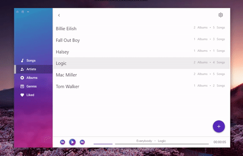
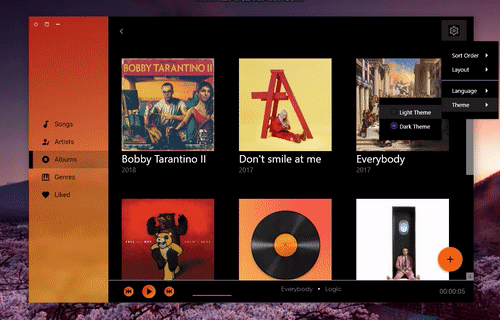
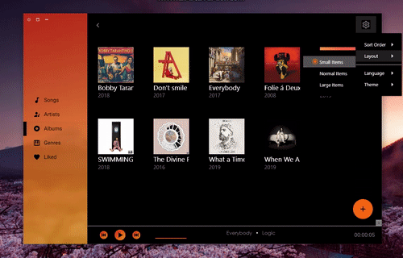
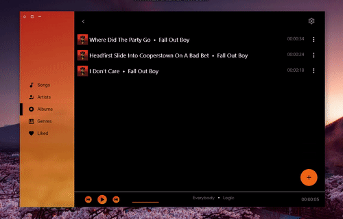

# MusicPlayer
Material designed Demo Music Player using WPF/MVVM

# Features:

- **Library categories**: all songs, artists, albums, genres and liked songs

   
  
   
   
  
- **Settings**:
  - Active tabs management
  - **Themes**: Light, Dark
   
  
   
   
  
  - **Languages**: English, Korean
  - **Sort options**: by Name descending and ascending
  - **Layout options**: Small items, Medium items and Large items
   
  
   
  
- **Folders browser**
- **Edit music metadata and album art** 

   
  
   
   
--------
